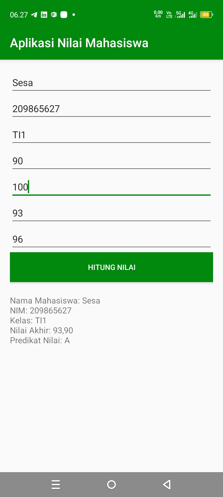
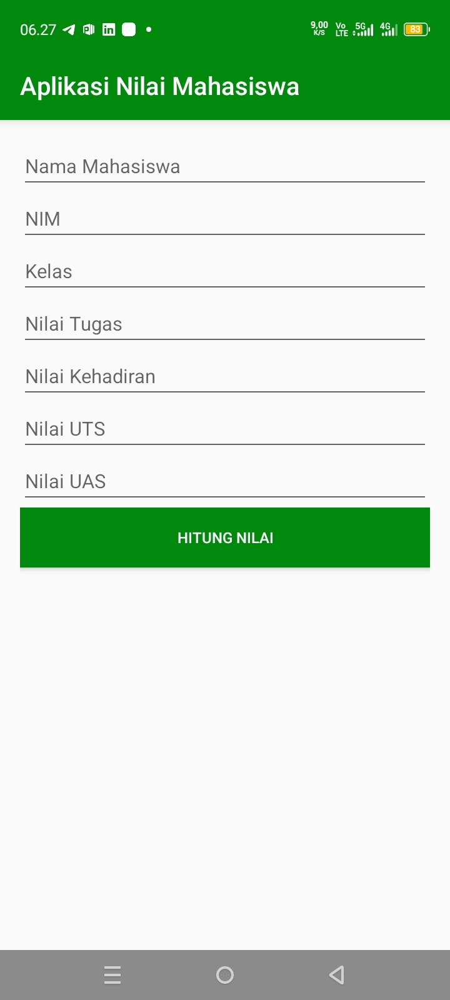

# APP NILAI MAHASISWA

Aplikasi **Hitung Nilai** berbasis **Android** yang digunakan untuk menghitung nilai mahasiswa.

Aplikasi ini dibuat menggunakan **Java** dengan antarmuka GUI (Graphical User Interface) dan menggunakan **FlatLaf** sebagai library untuk mempercantik tampilan aplikasi agar lebih modern.

## Author

Nama :  BangSesa  
Project : Aplikasi Hitung Nilai Sederhana Berbasis Java  
Tahun : 2025
